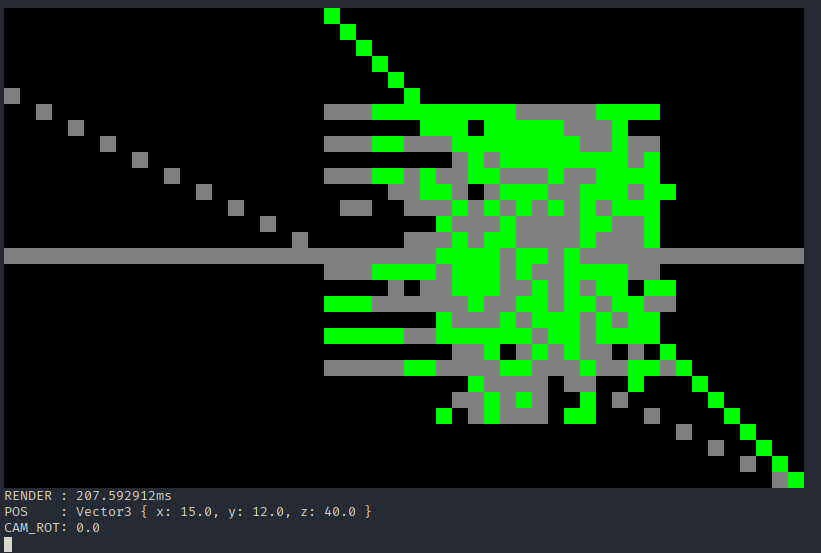

## Termcraft

I was hoping to be able to create a 3D minimalistic Minecraft clone in the terminal, however all I have now is some wierd intelligible gibberish being rendered.

## How to use

Cargo run and then WASD to move horizontally, Q and E for up and down, X and Y for camera rotation. Not that it matters, all you'll see is gibberish.

(note: it won't start rendering until you move)

## Extra

Initiate a new world by running `init_world.py`.

Also all the tests are broken because I renamed all of the coorinate components.